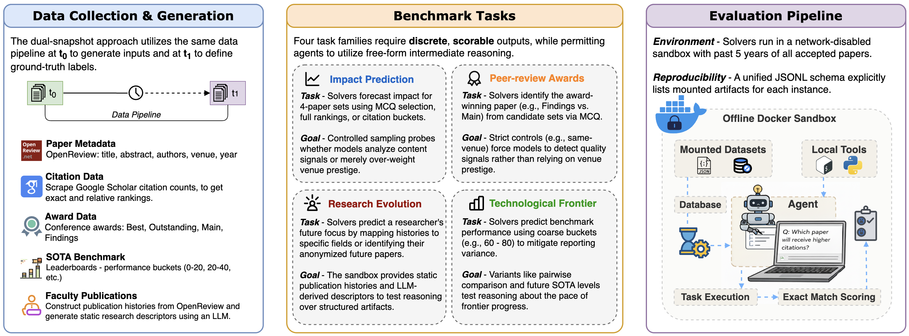
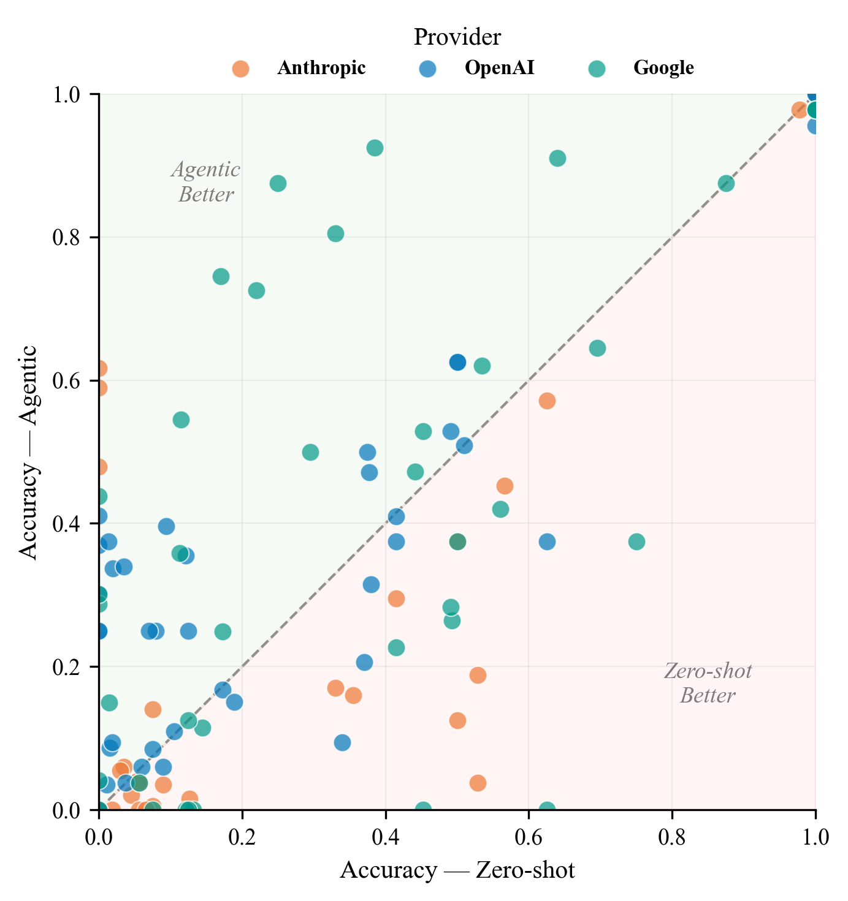

# Proof of Time: A Benchmark for Evaluating Scientific Idea Judgments

[](https://opensource.org/licenses/MIT)
[](https://huggingface.co/datasets/AIM-Harvard/proof-of-time)
[](https://www.python.org/downloads/)

**Proof of Time (PoT)** is a semi-verifiable benchmarking framework for evaluating scientific idea judgments. By *time-partitioning* evaluation data, we freeze evidence before a cutoff, ask models to forecast outcomes, and score them when the future arrives—enabling scalable, verifiable evaluation without manual labeling.

**Paper**: *Proof of Time: A Benchmark for Evaluating Scientific Idea Judgments* (Under Review)

You can download our generated questions from: https://huggingface.co/datasets/AIM-Harvard/proof-of-time/tree/main/benchmarks

**Key Features:**

- **Time-Partitioned**: Ground truth arrives naturally as time passes—no manual labeling needed
- **Semi-Verifiable**: Benchmarks link to real-world signals (citations, awards, leaderboards) that become observable post-cutoff
- **Scalable**: Over 30,000 instances spanning four task families
- **Agentic**: ReAct agents with sandboxed access to historical paper data

## Quick Start

```bash
# 1. Clone and install
git clone https://github.com/shan23chen/proof_of_time.git
cd proof_of_time
uv sync
source .venv/bin/activate

# 2. download data files from huggingface and patch them
export HF_TOKEN="your_hf_token"
huggingface-cli download AIM-Harvard/proof-of-time \
  --repo-type dataset \
  --include "benchmarks/*" \
  --local-dir ./temp_patch

rsync -av ./temp_patch/benchmarks/ ./benchmarks/
rm -rf temp_patch

# 3. Set up API keys
cp .env.example .env
# Edit .env with your API keys

# 4. Run a quick test (5 samples)
inspect eval benchmarks/award_react/benchmark.py@pre_cutoff_simple_task \
    --model openai/gpt-5-mini-2025-08-07 \
    --limit 5

# 5. Check results
inspect view
```

For detailed setup instructions, see [SETUP.md](SETUP.md).

## Table of Contents

- [Overview](#overview)
- [Task Families](#task-families)
- [Installation](#installation)
- [Running Benchmarks](#running-benchmarks)
- [Dataset](#dataset)
- [Analysis](#analysis)
- [Repository Structure](#repository-structure)
- [Key Results](#key-results)
- [Citation](#citation)
- [License](#license)

## Overview

Judging the quality of scientific ideas is hard. Current methods rely on immediate proxies—but true impact takes **time** to reveal itself. **Proof of Time (PoT)** solves this by *time-partitioning* the evaluation: we freeze evidence before a cutoff, ask models to forecast outcomes, and score them when the future arrives.

<p align="center">
  
</p>

*The PoT workflow: Evidence is frozen at a cutoff. Models forecast future outcomes. Ground truth arrives—enabling scalable, verifiable evaluation.*

### Why "Proof of Time"?

The name reflects our focus on temporal reasoning: agents must analyze historical patterns to make predictions about future research directions, award recipients, and citation impact. Tasks require genuine understanding of research trends rather than memorization.

### Benchmark Design

- **ReAct Agents**: Agents use tools (bash, Python, text editor) to explore sandboxed paper datasets
- **Sandboxed Environments**: Docker containers with read-only paper data (no internet access)
- **Offline Prompt**: Custom "Antigravity" prompt inspired by principles of focused exploration
- **Multiple Variants**: Each task has standard (agent), simple (zero-shot), and no-offline-prompt versions

## Task Families

The suite includes 4 task families(you can sample and generated a new test set anytime):

| Task Family                      | Description                                               | Agent Access                           |
| -------------------------------- | --------------------------------------------------------- | -------------------------------------- |
| **Impact Prediction**      | Forecasting paper influence (citations) from limited cues | Historical papers with citation counts |
| **Scientific Value**       | Predicting peer-review awards (Best Papers)               | Conference accepted papers             |
| **Research Evolution**     | Longitudinal reasoning about faculty trajectories         | Per-professor publication histories    |
| **Technological Frontier** | Extrapolating benchmark progress (SOTA)                   | Frontier model benchmark scores        |

### 1. Impact Prediction ([benchmarks/citation_react/](benchmarks/citation_react/))

Predict future citation counts for recently published papers. Can models identify which papers will have higher impact?

**Tasks:** Multiple choice, Ranking, Bucket prediction (0-1, 1-5, 5-10, 10-50, 50+ citations)

### 2. Scientific Value ([benchmarks/award_react/](benchmarks/award_react/))

Predict which papers will win best paper awards. Can models align with expert judgments?

**Tasks:** Pre-cutoff awards (2018-2024), Post-cutoff EMNLP/ACL/NAACL 2025 awards

### 3. Research Evolution ([benchmarks/future_work_react/](benchmarks/future_work_react/))

Predict research directions of AI faculty members based on publication history.

**Tasks:** Professor field prediction, Article attribution, Field focus classification

### 4. Technological Frontier ([benchmarks/sota_forecast/](benchmarks/sota_forecast/))

Extrapolate benchmark progress and forecast future SOTA metrics.

**Tasks:** Bucket prediction for benchmark scores (0-20, 20-40, 40-60, 60-80, 80-100)

## Installation

### Prerequisites

- Python 3.10 or higher
- Docker (for sandbox environments)
- uv package manager
- API keys for LLM providers

### Quick Install

```bash
# Clone repository
git clone https://github.com/shan23chen/proof_of_time.git
cd proof_of_time

# Install dependencies
uv sync
source .venv/bin/activate

# download data files from huggingface and patch them
export HF_TOKEN="your_hf_token"
huggingface-cli download AIM-Harvard/proof-of-time \
  --repo-type dataset \
  --include "benchmarks/*" \
  --local-dir ./temp_patch

rsync -av ./temp_patch/benchmarks/ ./benchmarks/
rm -rf temp_patch

# Configure API keys
cp .env.example .env
# Edit .env with your OpenAI/Anthropic/Google API keys
export $(cat .env | xargs)

# Verify Docker is running
docker ps
```

For detailed installation instructions, troubleshooting, and Docker setup, see [SETUP.md](SETUP.md).

## Running Benchmarks

### Single Task Example

```bash
# Run award prediction with GPT-5-mini (5 samples)
inspect eval benchmarks/award_react/benchmark.py@pre_cutoff_task \
    --model openai/gpt-5-mini-2025-08-07 \
    --limit 5
```

### All Tasks for a Benchmark

```bash
# Run all award prediction variants
inspect eval benchmarks/award_react/benchmark.py \
    --model openai/gpt-5-mini-2025-08-07

# Run all citation forecasting variants
inspect eval benchmarks/citation_react/benchmark.py \
    --model openai/gpt-5-mini-2025-08-07
```

### Systematic Ablations

Run all benchmarks across multiple models with ablations:

```bash
# Run all models and tasks (with/without offline prompt)
uv run scripts/run_inspect_ablations.py

# Run specific models only
uv run scripts/run_inspect_ablations.py \
    --models openai/gpt-5-mini-2025-08-07 google/gemini-3-flash-preview

# Run with different message limits
bash run_message_limit_sweep.sh
```

**Supported Models:**

- OpenAI: `gpt-5.2`, `gpt-5.1`, `gpt-5-mini`, `gpt-5-nano`
- Google: `gemini-3-pro`, `gemini-3-flash`, `vertex/gemini-2.5-pro/flash`
- Anthropic: `vertex/claude-opus-4-5`, `vertex/claude-sonnet-4-5`, `vertex/claude-haiku-4-5`

Logs are saved to `logs/ablations/<model-slug>/<task>.log`.

## Dataset

### HuggingFace Hub

Benchmark datasets and sandbox data are available on HuggingFace:

**Repository:** [AIM-Harvard/proof-of-time](https://huggingface.co/datasets/AIM-Harvard/proof-of-time)

```bash
# Download with datasets library
pip install datasets
python -c "from datasets import load_dataset; ds = load_dataset('AIM-Harvard/proof-of-time')"

# Or clone manually
git clone https://huggingface.co/datasets/AIM-Harvard/proof-of-time
```

### Dataset Structure

```
benchmarks/
├── award_react/          Award prediction tasks
├── citation_react/       Citation forecasting tasks
├── future_work_react/    Faculty prediction tasks
└── sota_forecast/        SOTA benchmark tasks

sandbox_data/
├── citation/             Historical papers with citations
├── award/                Conference accepted papers with tiers
├── faculty/              Conference accepted papers
└── sota/                 Conference accepted papers
```

### Regenerating Datasets

To create custom datasets or update with new data:

```bash
# Regenerate award prediction tasks
uv run python dataset_building/generate_award_datasets.py

# Regenerate citation forecasting tasks
uv run python dataset_building/generate_citation_datasets.py

# Regenerate faculty prediction tasks
uv run python dataset_building/generate_faculty_futurework.py

# Regenerate SOTA forecasting tasks
uv run python dataset_building/generate_sota_forecast.py
```

See [dataset_building/README.md](dataset_building/README.md) for detailed instructions.

## Analysis

### Comprehensive Analysis Pipeline

Generate plots, tables, and reports from evaluation logs:

```bash
# Run full analysis pipeline
cd analysis/comprehensive
python main.py

# Generate plots only
python main.py --plots-only

# Generate report only
python main.py --report-only
```

**Outputs:**

- `plots/` - Performance visualizations by model, task, ablation
- `tables/` - CSV summaries of results
- `REPORT.md` - Comprehensive markdown report

### Interactive Dashboard

Explore EMNLP paper topics and trends:

```bash
# Install dashboard dependencies
uv sync --extra dashboard

# Launch dashboard
python analysis/emnlp_topics_dashboard.py

# Export CSV summaries without UI
python analysis/emnlp_topics_dashboard.py --export
```

Access at http://127.0.0.1:8050 (use `--host` and `--port` to customize).

See [analysis/README.md](analysis/README.md) for more details.

## Repository Structure

```
proof_of_time/
├── benchmarks/              # Inspect AI benchmark implementations
│   ├── award_react/         # Award prediction tasks
│   ├── citation_react/      # Citation forecasting tasks
│   ├── future_work_react/   # Faculty prediction tasks
│   ├── sota_forecast/       # SOTA forecasting tasks
│   └── common/              # Shared utilities and prompts
├── dataset_building/        # Scripts to generate benchmark datasets
├── analysis/                # Result analysis and visualization
│   ├── comprehensive/       # Main analysis pipeline
│   ├── agent_behavior/      # Agent action analysis
│   └── query_analysis/      # Query pattern analysis
├── scripts/                 # Convenience scripts for running experiments
│   ├── run_inspect_ablations.py       # Systematic ablation runner
│   ├── upload_to_huggingface.py       # Dataset upload script
│   └── parse_ablation_logs.py         # Log parsing utilities
├── run_message_limit_sweep.sh         # Message limit experiments
├── .env.example             # API key configuration template
├── pyproject.toml           # Python dependencies
├── SETUP.md                 # Detailed setup instructions
├── CITATION.md              # Citation information
└── LICENSE                  # MIT License
```

## Key Results

### Do Agents Help?

Agentic systems generally outperform zero-shot baselines on tasks requiring evidence exploration.

<p align="center">
  
</p>

### Citation

If you use this benchmark suite in your research, please cite our work:

```bibtex
@misc{ye2026prooftimebenchmarkevaluating,
      title={Proof of Time: A Benchmark for Evaluating Scientific Idea Judgments}, 
      author={Bingyang Ye and Shan Chen and Jingxuan Tu and Chen Liu and Zidi Xiong and Samuel Schmidgall and Danielle S. Bitterman},
      year={2026},
      eprint={2601.07606},
      archivePrefix={arXiv},
      primaryClass={cs.CL},
      url={https://arxiv.org/abs/2601.07606}, 
}
```

See [CITATION.md](CITATION.md) for more details.

## License

This project is licensed under the MIT License - see the [LICENSE](LICENSE) file for details.

## Contributing

We welcome contributions! To add new benchmarks or improve existing ones:

1. Fork the repository
2. Create a feature branch
3. Add your benchmark following the patterns in `benchmarks/`
4. Add documentation (README.md for your benchmark)
5. Test with `inspect eval` and `--limit 5`
6. Submit a pull request

## Acknowledgments

- Built with [Inspect AI](https://inspect.ai-safety-institute.org.uk/) framework
- Uses data from ACL Anthology, Google Scholar, and Papers with Code
- Thanks to the AI research community for making papers publicly available

## Contact

- **Issues**: https://github.com/shan23chen/proof_of_time/issues
- **Project**: AIM Harvard
